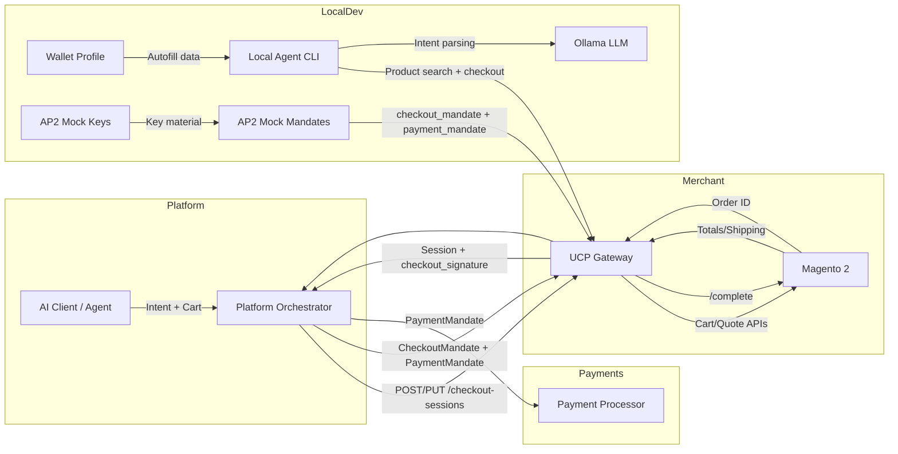

# Architecture

This MVP is a thin UCP gateway that translates platform checkout requests into Adobe Commerce (Magento 2) cart and order APIs.

## High-level flow

## Notes

- AP2 mode is server-driven when enabled; mandates are required on `/complete`.
- The gateway signs a checkout hash (detached JWT) and verifies platform/payment mandates.

## AP2 verification notes (MVP)

When AP2 is enabled, the gateway issues a `checkout_signature` for the current checkout
state and requires a `checkout_mandate` + `payment_mandate` on `/complete`. Mandates
are verified with configured public keys and checked against the session state hash,
session id, and nonce. For safety, the service rejects re-verification attempts and
requires the nonce to be present.
